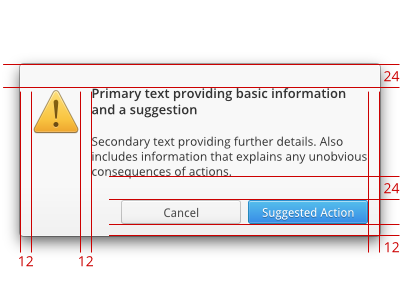

# Dialogs {#dialogs}

## Alert Text {#alert-text}

An alert contains both primary and secondary text.

The primary text contains a brief summary of the situation and offer a suggested action. This text should be displayed in a bold font that is slightly larger than the default.

The secondary text provides a more detailed description of the situation and describes any possible side effects of the available actions. It's important to note that a user should only need the primary text to make a decision and should only need to refer to the secondary text for clarification. This text should be placed one text line height beneath the primary text using the default font size and weight.

Make both the primary and secondary text selectable. This makes it easy for the user to copy and paste the text to another window, such as an email message.

## Button Order {#button-order}

* All dialogs should contain an affirmative button that performs the action suggested in the primary text. This button goes on the far right side of the window.
* For dialogs that are displayed in response to user action (such as "Quit"), provide a "Cancel" button directly to the left of the affirmative button.
* If your dialog has alternative actions, list them to the left of the "Cancel" button.
* If you wish your dialog to contain a "Help" button, this should be placed to the far left of the window.

## "OK" is not Okay {#ok-is-not-okay}

When presenting a dialog to a user, always use explicit action names like "Save...", "Shut Down", etc. Consider that using "OK" enables users to proceed without understand the action they are authorizing. Not all users will read the question or information presented to them in a dialog. Using specific action names will make it harder for a user to select an unintended action and may even encourage them to read the information presented before making a selection.

## Preference Dialogs {#preference-dialogs}

Preference dialogs should be made Transient, but not Modal. When a user makes a change in a preference dialog, the change should be immediately visible in the UI. If the dialog is modal, the user may be blocked from seeing (and especially from interacting with) the change. This means they will have to close the dialog, evaluate the change, then possibly re-open the dialog. By making the dialog transient, we keep the dialog on top for easy access, but we also allow the user to evaluate and possibly revert the change without having to close and re-open the preference dialog.

-------------------------------------------

See also:

1. [Why 'Ok' Buttons In Dialog Boxes Work Best On The Right](http://uxmovement.com/buttons/why-ok-buttons-in-dialog-boxes-work-best-on-the-right/) by UX Movement
2. [Why The Ok Button Is No Longer Okay](http://uxmovement.com/buttons/why-the-ok-button-is-no-longer-okay/) by UX Movement
3. [Should I use Yes/No or Ok/Cancel on my message box?](http://ux.stackexchange.com/questions/9946/should-i-use-yes-no-or-ok-cancel-on-my-message-box) on UX StackExchange
4. [Where to Place Icons Next to Button Labels](http://uxmovement.com/buttons/where-to-place-icons-next-to-button-labels/) by UX Movement

#### Next Page: [Window Titles](/docs/human-interface-guidelines/window-titles) {.text-right}