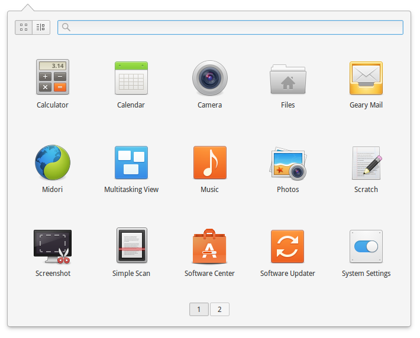
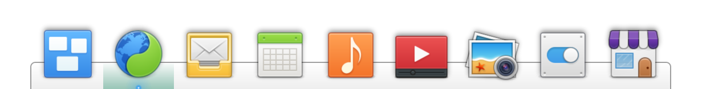
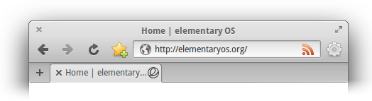
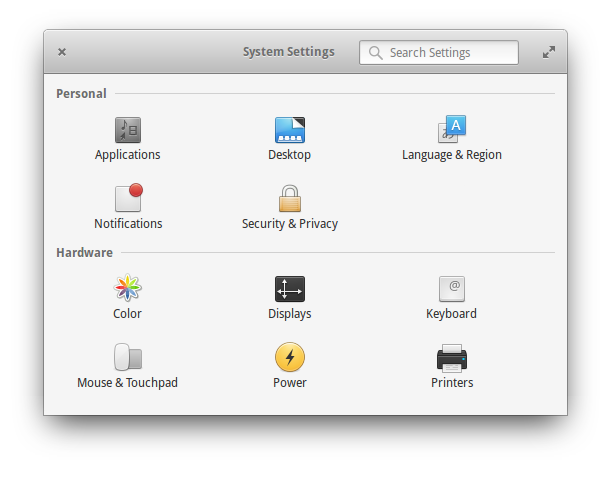

# Learning the Basics {#learning-the-basics}

As with every operating system there are some things that you may not be familiar with. This section will deal with how to complete simple, every day tasks such as browsing the web and listening to music, as well as other useful information that you may be unaware of.

## The Desktop {#the-desktop}
The elementary OS desktop is very simple and easy to learn. It consists of two elements: the panel and the dock. You can customize the desktop's wallpaper through **[System Settings](/docs/learning-the-basics#system-settings)** → **Desktop** → **Wallpaper**.

### The Panel {#the-panel}
At the top of the screen you can see the Panel. On the left is the Applications menu, in the center are the time and date, and on the right are the Indicators.

#### Applications {#applications}

On the left side of the panel is the Applications item. Clicking **Applications** brings up a launcher with all of your installed apps. You can view multiple pages of apps using the pagers at the bottom or by scrolling. You can also use the view switcher at the top to switch between a grid view and a category view.

You can search for apps by name or by keyword and perform actions associated with them. You can also search for system settings panes. Some of the actions you can find in search include:

* Shutdown and Restart
* Compose Message
* New Private Browsing Window
* Math operations (example: 23 * 5)

To open the applications menu with the keyboard, press <kbd>⌘</kbd> + <kbd>space</kbd>.

#### Indicators {#indicators}
On the right side of the panel are icons called Indicators. These tell you of the current status of your session, i.e. your network connections, battery power, time, chat and email accounts, etc. Clicking an indicator exposes more information and related actions.

### The Dock {#the-dock}
At the bottom of the screen is the Dock. It contains your favorite apps well as any apps that are currently open.

The contents of the dock are easily customizable. To add an app to the dock, drag and drop it from **Applications** on the panel or right-click an open app's icon and choose **Keep in Dock**. To remove an app from the dock, drag it off and drop it in an empty space on your desktop or right-click the icon and uncheck **Keep in Dock**. To rearrange apps on the dock, simply drag and drop them.

By default, the dock hides off the bottom of the screen when an app is maximized. Simply move your mouse to the bottom center of the screen to reveal the dock.

You can customize the dock's behavior through **[System Settings](/docs/learning-the-basics#system-settings)** → **Desktop** → **Dock**.

## App Windows {#app-windows}

Apps exist in their own windows which can be closed, maximized, or moved around.

When you open an app, its window appears on the desktop. Each app typically has three areas: the window buttons, a toolbar, and the contents of the app.

### Window Buttons {#window-buttons}
An app's window buttons are at the top corners of the app window. The close button is on the left and the maximize button is on the right. Pressing the close button will close the app's window. Pressing the maximize button will toggle whether the app window takes up the full screen or not. You can move an app's window around the desktop by dragging empty space between the window buttons.

### Toolbar {#toolbar}
Many apps have a toolbar at the top of the app. This area contains common actions or navigation items for the app. You can move an app's window around by dragging any blank area of a toolbar.

## Multitasking {#multitasking}

elementary OS supports two types of multitasking: windows and workspaces.

### Windows {#windows}
Apps open in app windows. They can overlap on your desktop and be moved around. You can switch between windows several ways:

* click on the window you want to switch to
* click on the app's icon in the dock
* press <kbd>Alt</kbd> + <kbd>Tab</kbd>
* To see an overview of your open app windows, press <kbd>⌘</kbd> + <kbd>W</kbd>.

You can customize these shortcuts through **[System Settings](/docs/learning-the-basics#system-settings)** → **Keyboard** → **Shortcuts** → **Windows**.

### Hot Corners {#hot-corners}
You can also configure "hot corners" (shortcuts activated by placing your cursor in the corner of the display) to activate multi-tasking functions like the window overview, workspace overview, and more.

You can customize hot corners through **[System Settings](/docs/learning-the-basics#system-settings)** → **Desktop** → **Hot Corners**.

### Workspaces {#workspaces}
By default, all app windows open on one workspace. However, you can use multiple workspaces to organize your workflow:

* To see an overview of your workspaces, press <kbd>⌘</kbd> + <kbd>S</kbd>
* To quickly move left or right through your workspaces, press <kbd>⌘</kbd> + <kbd>←</kbd> or <kbd>⌘</kbd> + <kbd>→</kbd>
* To cycle through your workspaces, press <kbd>⌘</kbd> + <kbd>Tab</kbd>
* You can jump straight to a specific workspace by pressing <kbd>⌘</kbd> + <kbd>1</kbd> through <kbd>⌘</kbd> + <kbd>9</kbd>. You can always jump to a new workspace with <kbd>⌘</kbd> + <kbd>0</kbd>.
* You can also drag app windows between workspaces by dragging their icons in the workspace overview, or move them left and right between workspaces using <kbd>⌘</kbd> + <kbd>Alt</kbd> + <kbd>←</kbd> or <kbd>→</kbd> respectively. To see an overview of app windows across all workspaces, press <kbd>⌘</kbd> + <kbd>S</kbd>.

You can customize these shortcuts through **[System Settings](/docs/learning-the-basics#system-settings)** → **Keyboard** → **Shortcuts** → **Workspaces**.

_Note: <kbd>⌘</kbd> refers to the "super" key. It is also known as the "Windows" key on most PCs or the "Command" key on Macs._

### Multiple Displays {#multiple-displays}
The panel, dock, and workspaces appear only on the primary display. Any other attached displays act as standalone workspaces. To manage and rearrange displays, head to **[System Settings](/docs/learning-the-basics#system-settings)** → **Displays**. Your primary display is marked with a filled-in star (<i class="fa fa-star"></i>) and each display's settings can be changed from its cog (<i class="fa fa-cog"></i>) menu.

## Installing Apps {#installing-apps}

elementary OS comes bundled with **AppCenter**, an app store for free apps. Installing a new app from AppCenter is easy:

1. Open the **AppCenter** app.
2. Search in the top-right, or browse.
3. Click **Install** next to the app you want to install.

You may be asked for your password prior to installing an app.

_Note: Some software may not be available from AppCenter. While we don't recommend downloading software from the general Internet, apps that are compatible with Ubuntu 16.04 LTS should work on elementary OS Loki._

## Updating {#updating}

elementary OS includes updates as part of AppCenter. Notice the tab "Updates" at the top of the window. We recommend you check for updates at least _once a week_ to make sure your computer has the latest features and protection.

For more information related to security patches, read the <a href="http://www.ubuntu.com/usn/xenial/">Ubuntu security notices</a>.

## System Settings {#system-settings}

elementary OS comes with a handy app called "System Settings" that controls all of your system-wide (or "global") preferences. System Settings gives you the ability to adjust things like keyboard shortcuts, display resolution, your wallpaper, and more.

### Search {#search}
You can quickly find settings you are looking for by typing keywords in the search bar at the top of the window. The contents of the System Settings window will filter down to match your search.

### App Settings {#app-settings}
Keep in mind that System Settings only deals with the global preferences for elementary OS. Although, some apps may also have their own preferences, you will not find them here. Instead, look for them inside the app in question.
