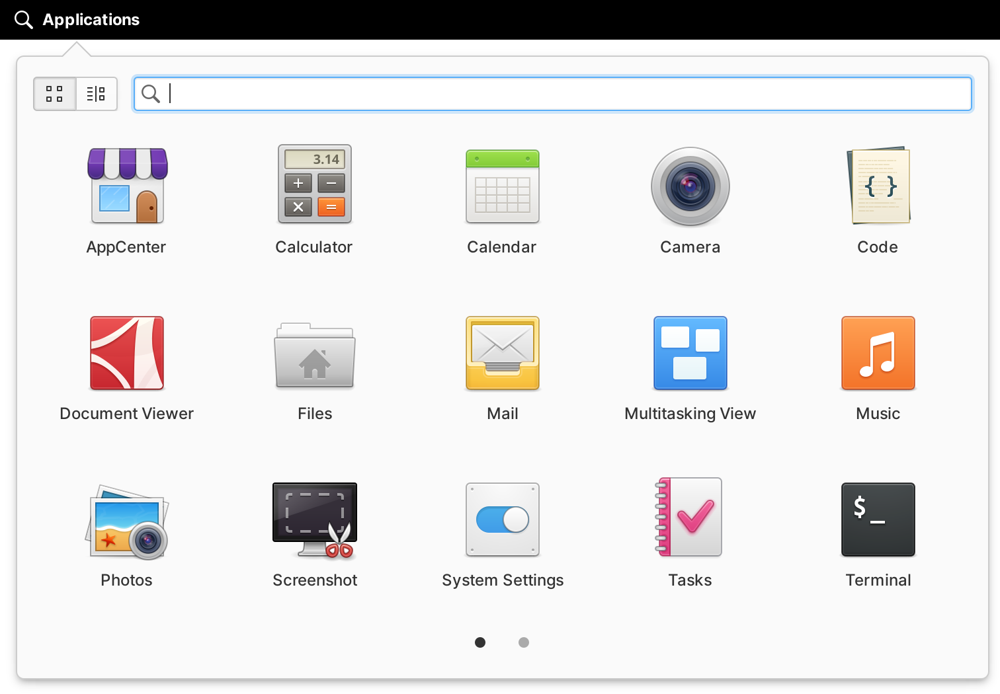
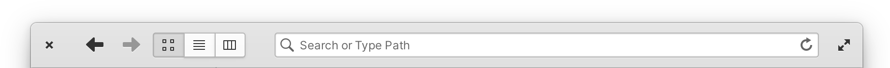
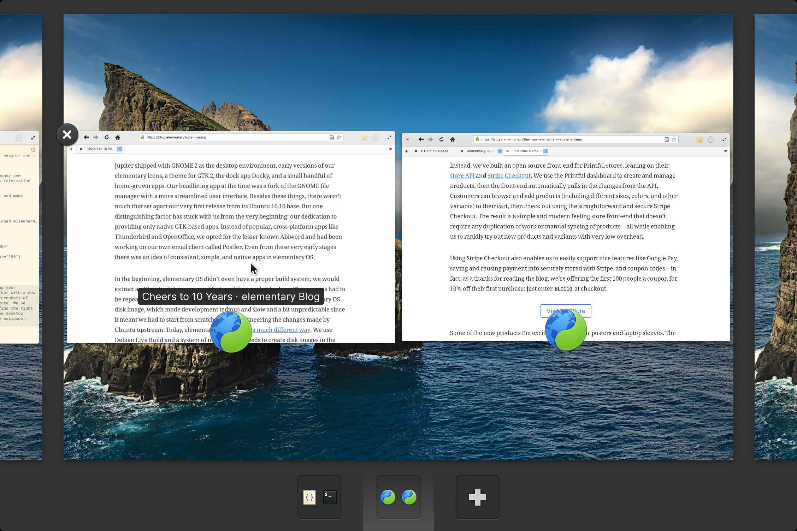
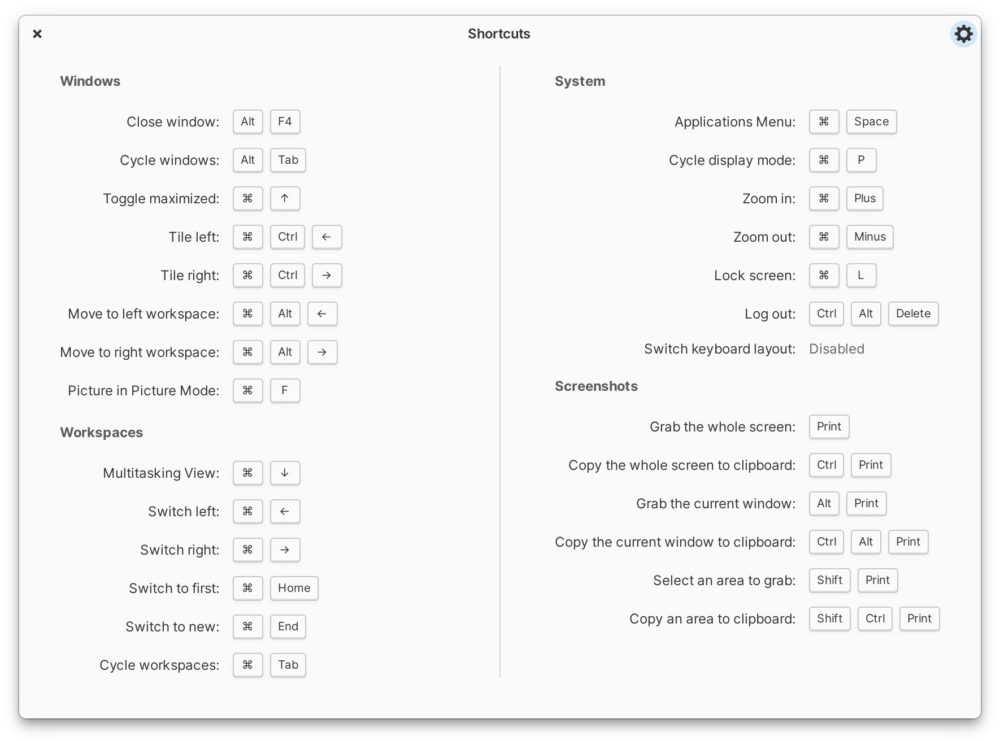

# Learning the Basics {#learning-the-basics}

Learn about the elementary OS desktop and how to navigate windows, workspaces, and more.

## Desktop {#desktop}

The elementary OS desktop consists of two elements: the Panel and the Dock. You can customize the desktop wallpaper by secondary-clicking the desktop—right click on a mouse, or two-finger tap on a touchpad. You can also change the desktop's look and behavior from **[System Settings](#system-settings)** → **Desktop**.

### Panel {#panel}

At the top of the desktop is the Panel. On the left is the Applications Menu, in the center are the date and time, and on the right are the System Indicators.

  <ol>
    <li>Applications Menu</li>
    <li>Date &amp; Time</li>
    <li>System Indicators</li>
  </ol>
  

#### Applications Menu {#applications-menu}

To open or search for installed apps, select **Applications** on the Panel. You can page through your apps by scrolling on a mouse, swiping with two fingers on a touchpad, or by using the pager dots at the bottom. You can also use the view switcher at the top to switch between showing your apps in a grid or a categorized list.

Start typing in the Applications Menu to search your apps by name or by keyword. Searching will also display app actions and System Settings. For example, by searching you can:

- **Shut Down** or **Restart** your device
- **Compose Message** with Mail
- Open a **New Incognito Window** in Web
- Calculate quick math operations like **23 \* 5**
- Take a **Screenshot of the Current Window**
- Find specific settings like **Keyboard → Layout → Compose Key**

To open the Applications Menu with the keyboard, press <kbd title="Super, or the Windows or Command key">⌘</kbd><kbd>Space</kbd>.

#### Date &amp; Time {#date-time}

The Date & Time indicator at the center of the Panel displays the current date and time. Click or tap anywhere on the date or time to display a calendar and upcoming events. Double-click a day or select an event to open it in the full Calendar app.

#### System Indicators {#indicators}

The System Indicators at the right of the Panel display the status of device, i.e. network connections, battery, sound input and output, notifications, etc. Selecting an indicator exposes more information and related actions.

Hovering an indicator with the mouse cursor also displays quick information and the middle-click or three finger tap shortcut for the indicator. For example:

- Sound: Mute
- Bluetooth: Turn Bluetooth on or off
- Power: Toggle percentage of battery remaining in the Panel
- Notifications: Toggle Do Not Disturb mode
- Session: Prompt to shut down

### Dock {#dock}

At the bottom of the desktop is the Dock for quick access to your favorite and currently-opened apps.

To add an app to the Dock, drag and drop it from the Applications Menu or secondary-click an open app's icon and choose **Keep in Dock**. To remove an app from the Dock, drag it off and drop it in an empty space on your desktop or secondary-click the icon and uncheck **Keep in Dock**. Drag and drop apps on the Dock to rearrange them.

By default, the Dock hides off the bottom of the desktop when an app is maximized or overlaps it. Push your mouse cursor against the bottom-center of the desktop to reveal and use the Dock when it's hidden.

You can customize the dock's size and behavior in **[System Settings](#system-settings)** → **Desktop** → **Dock & Panel**.

## App Windows {#app-windows}

When you open an app, its window appears on the desktop. While the exact design of different apps may differ, app windows can generally be closed, moved, resized, and maximized.

### Header Bar {#headerbar}

Most apps have a Header Bar at the top of their window with the Window Buttons and the app's actions or navigation.

Move a window by dragging anywhere on the Header Bar or by pressing <kbd>Alt</kbd><kbd>F7</kbd> and moving your mouse cursor.

Secondary-click the Header Bar for quick access to window and workspace actions.

#### Window Buttons {#window-buttons}

An app's window buttons are at the top corners of the app window: close at the left and maximize (if supported by the app) at the right. Closing a window will close that app; it can be re-opened from the Applications Menu or Dock. Maximizing a window resizes it to take up most of the desktop while retaining your access to the Panel and Dock.

You can also drag a window to the top of the desktop or double-click its header bar to maximize, and drag from the top or double-click the header bar to unmaximize.

### Resizing {#resizing}

Most app windows can be resized by draging from any edge of the window. You can also secondary-click a window's header bar and choose **Resize** or press <kbd>Alt</kbd><kbd>F8</kbd> to enter a resize mode: move the mouse cursor in the direction you want to resize the window.

## Multitasking {#multitasking}

elementary OS uses both windows and workspaces for multitasking.

### Windows {#windows}

App windows can overlap on your desktop and be moved around. You can switch between open windows several ways:

- Click or tap on the window you want to switch to
- Click or tap the app's icon in the dock
- Press <kbd>Alt</kbd><kbd>Tab</kbd> to cycle through windows

### Workspaces {#workspaces}

By default, app windows open on your current workspace. However, you can use multiple workspaces to organize your workflow:

To move left or right through your workspaces, press <kbd title="Super, or the Windows or Command key">⌘</kbd><kbd>←</kbd> or <kbd title="Super, or the Windows or Command key">⌘</kbd><kbd>→</kbd> or swipe with three fingers on a touchpad or touch screen.

Jump straight to a specific workspace by pressing <kbd title="Super, or the Windows or Command key">⌘</kbd><kbd>1</kbd> through <kbd title="Super, or the Windows or Command key">⌘</kbd><kbd>9</kbd>. You can always jump to a new workspace with <kbd title="Super, or the Windows or Command key">⌘</kbd><kbd>0</kbd>.

Move windows between workspaces by dragging them in the [Multitasking View](#multitasking-view) or by pressing <kbd title="Super, or the Windows or Command key">⌘</kbd><kbd>Alt</kbd><kbd>←</kbd> or <kbd>→</kbd>.

Customize these shortcuts through **[System Settings](#system-settings)** → **Keyboard** → **Shortcuts** → **Workspaces**.

Some windows may also fullscreen onto a new workspace. You can move between workspaces as usual, and closing or un-fullscreening the app will return you to the previous workspace.

### Multitasking View {#multitasking-view}

The Multitasking View shows all open windows and workspaces so you can switch between them. To open it, select the **Multitasking View** icon in the dock, press <kbd title="Super, or the Windows or Command key">⌘</kbd><kbd>↓</kbd>, or swipe up with three fingers on a touchpad or touch screen.

### Gestures {#gestures}

elementary OS supports multi-touch gestures on supported hardware like touchpads and touch screens. By default, a three-finger swipe left or right switches workspaces while a three-finger swipe up enters the Multitasking View.

Modify gestures from **[System Settings](#system-settings)** → **Mouse &amp; Touchpad** → **Gestures**.

### Hot Corners {#hot-corners}

Hot Corners are shortcuts activated by placing your cursor in the corner of the primary display. You can configure Hot Corners to activate multitasking actions like the window overview, workspace overview, and more.

You can customize hot corners through **[System Settings](#system-settings)** → **Desktop** → **Multitasking**.

### Multiple Displays {#multiple-displays}

The Panel, Dock, and workspaces appear on the primary display. Any other attached displays act as standalone workspaces. To manage and rearrange displays, head to **[System Settings](#system-settings)** → **Displays**. Your primary display is marked with a filled-in star (<i class="fa fa-star"></i>) and each display's settings can be changed from its <i class="fa fa-cog"></i> menu.

## Installing Apps {#installing-apps}

elementary OS comes with **AppCenter**, the open, pay-what-you-can app store for indie developers. To install a new app:

1. Open **AppCenter**
2. Search in the top-right, or browse by category
3. Select **Free** or the suggested price next to the app you want to install. To choose a different price, select the **▾** button and select or enter your own price.

### Sideload {#sideload}

Some third-party software may not be available from AppCenter, especially if it is cross-platform and not designed for elementary OS. You can sideload Flatpak apps from third-party sources like [Flathub](https://flathub.org): download and open a `.flatpakref` or `.flatpak` file, and the Sideload utility will install it for you. Updates to that app and other apps from the same source may then show up as non-curated in AppCenter.

Keep in mind that sideloaded and non-curated apps have not been reviewed by elementary for security or privacy.

## Updating {#updating}

AppCenter includes updates for apps and the operating system itself under the **Installed** tab. Remember to install updates frequently to get the latest features, fixes, and security improvements. For more information related to security patches, read the [Ubuntu security notices](https://usn.ubuntu.com/).

## System Settings {#system-settings}

elementary OS comes with the **System Settings** app that helps you manage device settings and user preferences. System Settings enables you to adjust keyboard shortcuts, display resolution, your wallpaper, and more.

### Search {#search}

You can find specific settings by typing in the search bar at the top of the window.

### App Settings {#app-settings}

Keep in mind that System Settings only deals with system-wide settings and user preferences for elementary OS. If an app offers settings or preferences, they will be exposed within the app itself.

## Keyboard Shortcuts {#keyboard-shortcuts}

Keyboard shortcuts in elementary OS are generally exposed contextually in tooltips when hovering or context menus when secondary-clicking.

To view an overlay of desktop keyboard shortcuts, press the <kbd title="Super, or the Windows or Command key">⌘</kbd> key.

Desktop keyboard shorcuts can be customized from the <i class="fa fa-cog"></i> menu in the shortcuts overlay or in **[System Settings](#system-settings)** → **Keyboard** → **Shortcuts**.
